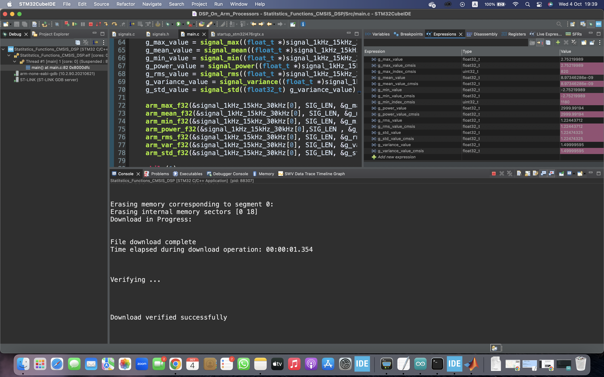

# STM32-NUCLEO projects

Designed for an STM32L476 microcontroller and includes functions for statistical analysis and signal processing.
The code calculates various statistical metrics of a signal, both through custom functions and using the ARM CMSIS-DSP library.
The calculated metrics include maximum value, mean, minimum value, power, root mean square (RMS), standard deviation, and variance.
In addition, this project include measure and compare the execution time of custom signal analysis functions and the equivalent functions provided by the ARM CMSIS-DSP library.
These measurements provide insights into the relative performance of the custom and library functions for signal analysis.

